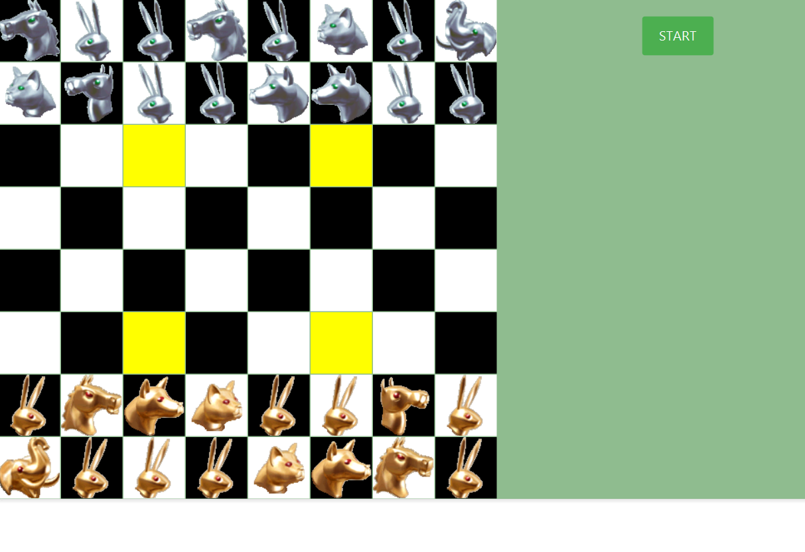

# Arima Game 

## 📌 Overview

Arima is a strategy board game similar to chess. This project implements the game with player-vs-player (PVP) mode.

## 📌 Features

- **All Rules Implemented**: All core rules of the game are implemented, including piece movements, capturing, and game-ending conditions.
- **Customizable Piece Placement**: Players can place their pieces in any arrangement at the beginning of the game according to the rules.
- **Game Timer**: Implements a game timer to track how much time each player spends thinking.
- **Player vs Player**: Play locally with another user on the same computer.

## 📌 Technologies Used 

- **JavaFX**: For building the graphical user interface (GUI).
- **Maven**: Project management tool for dependency management and building the application.
- **JUnit**: For testing and ensuring the correctness of game logic.
- **Log4j**: For logging and debugging purposes.

## 📌 How to Play
  You can find the complete official rules of Arimaa and detailed gameplay mechanics [here](https://www.arimaa.com/arimaa/Rules/).

## 📌 Screenshots:



## 📌 Project Status 

This project is currently **under development**. 

I am working on the visual aspects of the game, making sure the interface is clean, intuitive, and engaging. The game’s appearance is being developed using **JavaFX**, and improvements are ongoing.

## 📌 How to Run the Project

1. Clone the repository to your local machine.
2. Make sure you have [Java 19](https://openjdk.java.net/projects/jdk/19/) installed.
3. Install Maven if you don't already have it: [Install Maven](https://maven.apache.org/install.html).
4. Navigate to the project directory in the terminal or command prompt.
5. Run the following command to build the project:

   ```bash
   mvn clean install
6. Once the project is built, you can run it using:
    ```bash 
   mvn javafx:run

